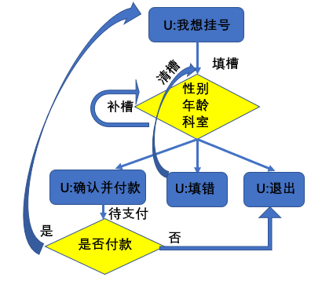
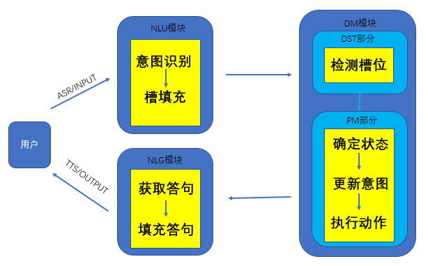

##
# 一，分类介绍

> 按需求划分

|      | 任务型               | 问答型             | 聊天型   |
| ------ | ---------------------- | -------------------- | ---------- |
| 目的 | 完成特定任务         | 回答问题           | 聊天     |
| 领域 | 垂直领域             | 垂直领域和开放领域 | 开放领域 |
| 应用 | 办理业务、顾客回访等 | 搜索、客服等       | 闲聊     |

> 按答案产出方式划分

1. 检索式问答:答案存在基础资源中
2. 生成式问答:答案不存在基础资源中，通过模型生成

> 按基础资源划分

1. FQA库问答
2. 长文本(文档/网页/书籍等)问答
3. 知识图谱问答
4. 等

# 二，基本流程

1. 确定需求和数据基础
2. 理清问答的流程
3. 选取合适的数据库和NLP模型

# 三，可选方案

> 限于个人知识和能力，一点点更新

## 1.任务型问答

1. 根据任务需求确定对话状态和槽位
2. 根据对话状态和槽位构建对话树
3. 根据对话树完成对话系统流程

> 对话树

> 对话流程

## 2.问答型

> 比如根据FQA库进行单轮问答

1. 构建FQA库
2. 对数据进行采样训练模型
3. 完成一问一答式问答

# 四，工程问题

每种方式都有不同的问题

# 五，经验总结

尽量使需求简单化，指标明确化，流程清楚化。不然及没法评价也很难做出来
