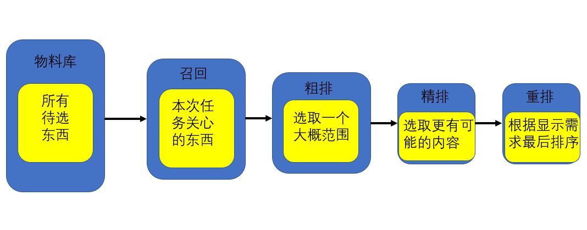

##
# 一，使用场景

> 前提:1.数据量很大 2.人处理不过来

1. 内容推荐:新闻、视频等
2. 广告推荐:商品、品牌等
3. 方案推荐:付款方式、交通路线等

# 二，组成模块

> 根据具体任务的类型、物料库大小、模型速度等因素决定模块，不是全都要




# 三，一些方法

## 1.协同过滤召回

> 算法能使用的前提是有类似user-item矩阵的数据

### User-CF

> 通过查找与当前用户相似的用户来给当前用户没有看过的物品打分，之后进行排序;比如吃了北京烤鸭的人都喜欢吃宫保鸡丁

```python
item_score = []
for item in 待推荐物品集合:
    for user_like in 相似用户集合:
        score = get_score_from_similar_users()
        item_score.append([item,score])
```

### Item-CF

> 通过查找与曾经看过的物品相似的物品对没看过的物品进行打分，之后进行排序;比如看了大庆赶海的视频后又推荐大庆赶海相似的视频

```python
item_score = []
for item in 待推荐物品集合:
    for item_like in 用户喜欢的物品集合:
        score = get_score_from_similar_items()
        item_score.append([item,score])
```

### 优缺点

优点：

1. 实现相对简单
2. 利用了其他用户/物品的信息

缺点:

1. 冷启动做不了，数据支持很差效果肯定不好
2. 新的东西很难被推荐，因为没什么人看，就没什么打分

## 2.内容召回

> 比如搜索系统

1. 统计方法:TFIDF,BM25排序
2. 模型方法:判断相似度

### 优缺点

优点:

1. 不需要其他用户信息
2. 可以推荐出新东西、冷东西

缺点:

1. 每次结果都一样，没有惊喜

## 3.运营召回

> 比如搜索引擎的前面几条，又或者买断新闻的头条

## 4.排序学习(learn to rank)

### 数据标注方式

1. 单点标注(PointWise)
2. 两两标注(PairWise)
3. 列表标注(ListWise)

### 排序模型

1. wide & deep
2. Youtube召回
3. 阿里DIN
4. 阿里Bert4Rec
5. 等

## 5.特征工程

> 目标:将模型不能处理的特征转换成模型能够处理方便处理的数字。数据决定任务效果的上线，模型只能尽力接近这个上线!

### 离散特征

> 名字，性别，身份等

1. one-hot
2. 组合后的multi-hot/多标签的multi-hot
3. Embedding

### 连续特征

> 身高，体重，收入等

1. 归一化(0,1):softmax、min-max(多数据)，sigmoid(单数据)
2. 标准化(0均值1标准差):BN/LN
3. 离散化(将连续值当离散值处理):等距拆分、等频拆分

# 四，工程问题

## 1.冷启动

### 物料冷启动

对于新出现的物料，给更多的曝光，主动分配到推荐或者某领域头部。比如B站上我新上传一个视频会有一些新手保护流量，但过一两天就没了

### 用户冷启动

对于新加入的用户，引导用户填写喜好领域或者随机推荐收集用户喜好。比如斗鱼的喜好领域选取和抖音上来就放短视频

## 2.A/Btest

不同的策略分给不同的人去进行测试，可能会出现线上线下不一致的问题，那就要排查模型、数据、场景等因素是不是有比变化


# 五，经验总结

推荐做的很浅，没什么经验...

大致重要性:场景任务>数据>特征>算法
