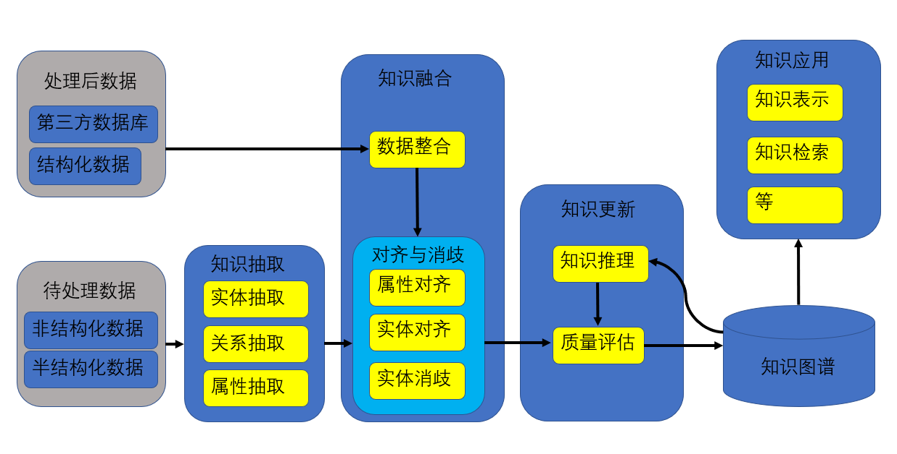

##
# 一，使用场景

1. 知识问答:百度等搜索引擎的搜索等
2. 信息查询:企业信息查询等
3. 关系查询:人物关系图谱等
4. 辅助决策:金融风控等

# 二，基本方法

> 不是只有图数据库才能做知识图谱，Mysql,Elastic Search等数据都可以,还可以组合使用

架构(个人理解，可能有缺失或者偏差):

1. 确定问题或数据格式(来源)
2. 选用合适的数据库
3. 根据架构一部分一部分的完成,或多人并行完成
4. 封装接口

# 三，可选方法

> 限于个人知识和能力，一点点更新

## 1.知识抽取

### 实体抽取

1. 基于规则+字典的正则表达式抽取
2. 基于模型的序列标注抽取

### 关系属性抽取

1. multi-task联合训练(input:sentence,output:三元组数据)
2. R-Bert(input:sentence with entity token,output:relation，attribute)

## 2.知识融合

### 实体对齐

通过实体的不同属性之间的相似度来判断是否为同一个实体

### 实体消岐

| id | 实体名 | 实体描述                                                                   |
| ---- | -------- | ---------------------------------------------------------------------------- |
| 1  | 苹果   | 美国一家高科技公司，经典的产品有手机电脑等电子设备                         |
| 2  | 苹果   | 水果的一种，果实球形，味甜，口感爽脆，且富含丰富的营养，是世界四大水果之冠 |

ori:今天苹果发布了一款新的手机->input:今天发布了一款新的手机->encoding:[vector_in]

可能1:美国一家高科技公司，经典的产品有手机电脑等电子设备->encoding:[vector_prod1]

可能2:水果的一种，果实球形，味甜，口感爽脆，且富含丰富的营养，是世界四大水果之冠->encoding:[vector_prod2]

对比:Similarity(vector_in,vector_prod1)与Similarity(vector_in,vector_prod2)

### 属性/属性值对齐

对属性或属性值进行相似度判断

## 3.知识更新

### 知识推理

1. 基于规则:小明的爸爸叫李刚，李华的爸爸叫李刚->小明和李刚是兄弟
2. 基于模型:KG-Bert的关系判断[KG-BERT: BERT for Knowledge Graph Completion (arxiv.org)](https://arxiv.org/pdf/1909.03193.pdf)

### 质量评估

KG-Bert的三元组判断[KG-BERT: BERT for Knowledge Graph Completion (arxiv.org)](https://arxiv.org/pdf/1909.03193.pdf)

## 4.知识应用

### 知识问答

1. 模板匹配:根据需求定义模板和对应的SQL、Cypher语句等
2. 语义解析:X-SQL[1908.08113v1.pdf (arxiv.org)](https://arxiv.org/pdf/1908.08113v1.pdf)

### 知识表示

目前没接触过，略

# 四，工程问题

上面的每个点都是问题，QAQ

# 五，经验总结

**一定一定要先讨论清楚构建的知识图谱是拿来做什么的**，不然搭到后面老板~~一拍脑门~~有了新思路就白做了，先确定需要处理的问题，再进行后面的步骤分析
